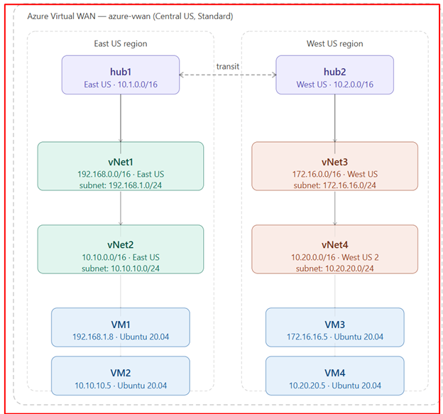

# Azure Virtual WAN Hub-Spoke Lab 🌐

## Overview
Enterprise hub-and-spoke network topology deployed 
on Azure using Terraform Infrastructure as Code.

## Architecture

- **Azure Virtual WAN** (Standard) - Central US
- **Hub1** - East US (10.1.0.0/16)
- **Hub2** - West US (10.2.0.0/16)
- **vNet1** - East US (192.168.0.0/16)
- **vNet2** - East US (10.10.0.0/16)
- **vNet3** - West US (172.16.0.0/16)
- **vNet4** - West US 2 (10.20.0.0/16)
- **4 Ubuntu VMs** - one per VNet

## Technologies Used
- Terraform
- Azure Virtual WAN
- Azure Virtual Networks
- Azure Virtual Hubs
- Ubuntu 20.04 LTS
- Azure CLI

## Results
Successfully verified cross-region connectivity:
| Source | Destination | Latency | Status |
|--------|-------------|---------|--------|
| VM2 | VM1 | 2.8ms | ✅ |
| VM2 | VM3 | 70ms | ✅ |
| VM2 | VM4 | 93ms | ✅ |

## How to Deploy
### Prerequisites
- Azure CLI installed
- Terraform installed
- Azure subscription

### Steps
1. Clone this repo
   git clone https://github.com/krir/azure-vwan-lab.git
   
2. Login to Azure
   az login

3. Initialize Terraform
   terraform init

4. Preview changes
   terraform plan

5. Deploy
   terraform apply

6. Cleanup
   terraform destroy

## Author
Kennedy Kipronok
Azure Cloud Engineer